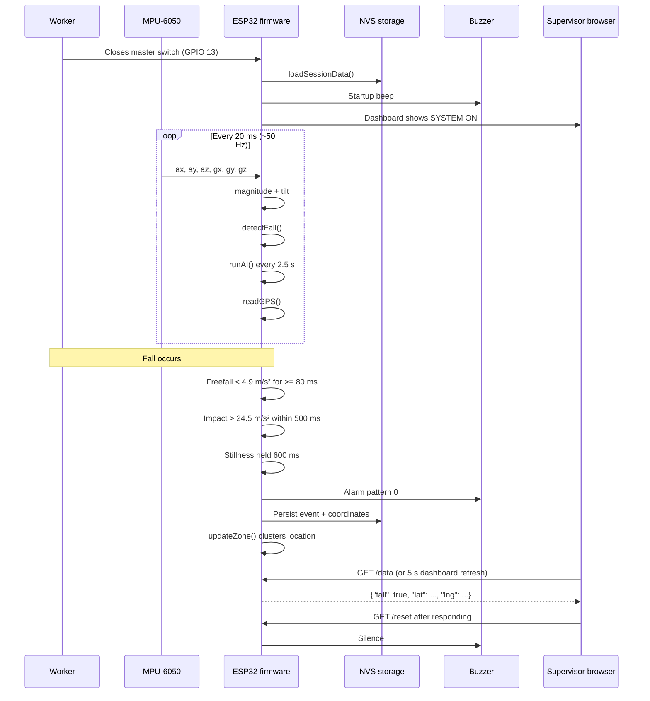
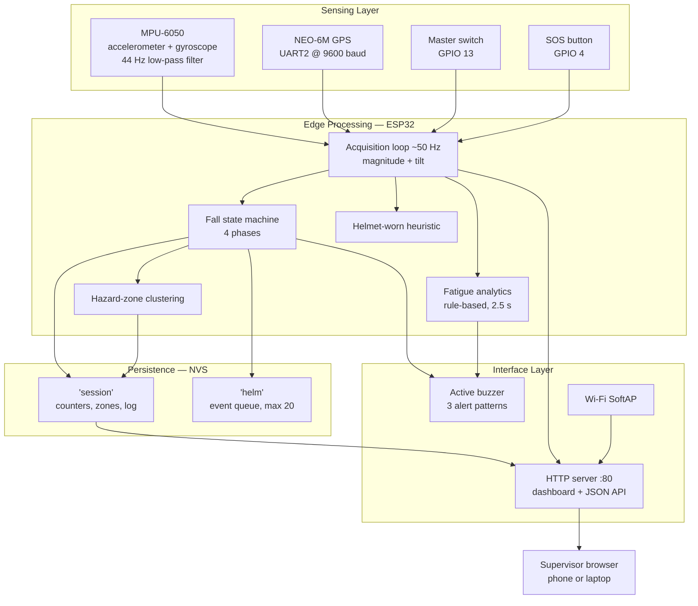
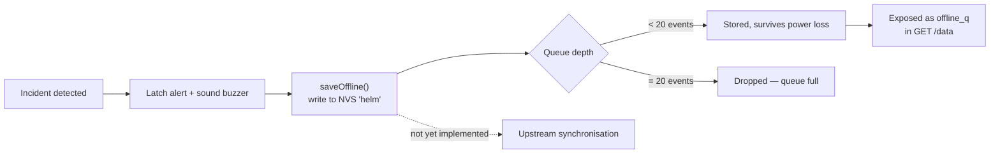
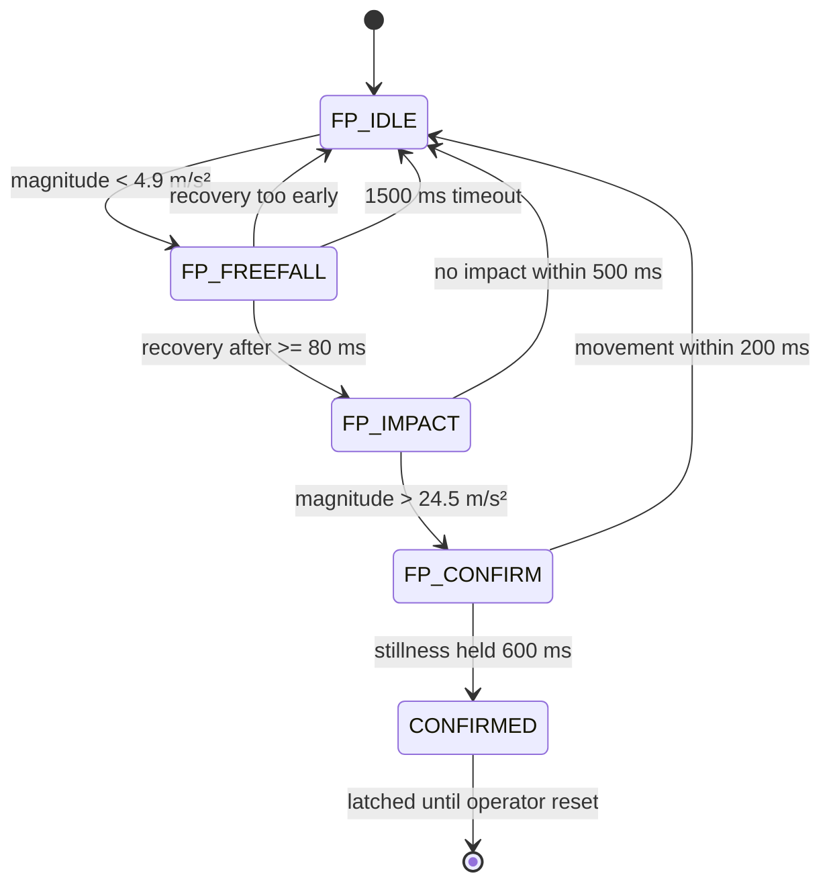
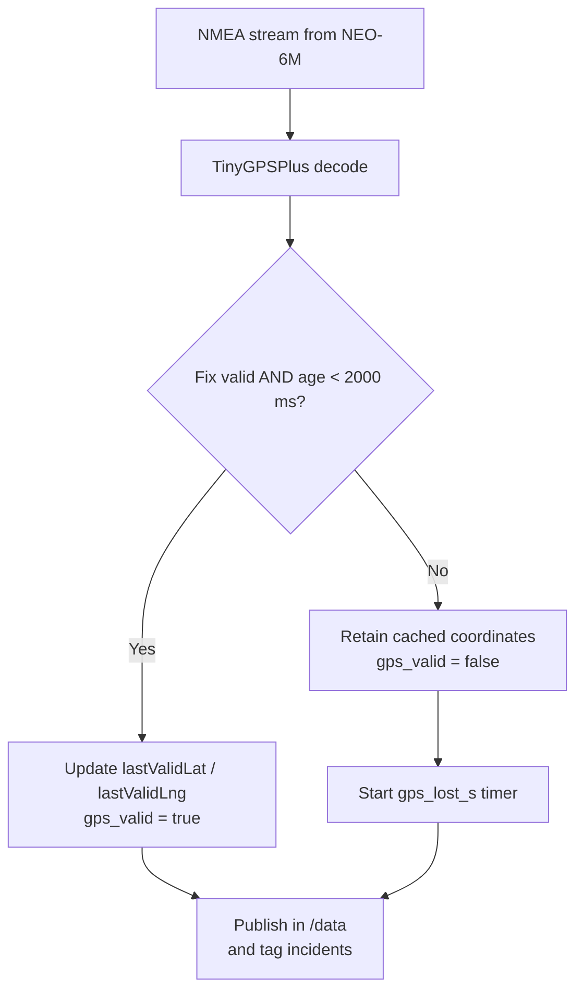

# Sentry AI — AI Smart Safety Helmet

> An ESP32-based smart safety helmet that detects falls through a staged motion-analysis algorithm, geotags incidents, monitors worker fatigue with on-device sensor analytics, and serves a live dashboard over its own Wi-Fi Access Point — with no dependency on site connectivity.

<p align="left">
  
  
  
  
  
  
</p>

---

## Table of Contents

| | Section | | Section |
|---|---|---|---|
| 1 | [Project Overview](#1-project-overview) | 11 | [Fall Detection Workflow](#11-fall-detection-workflow) |
| 2 | [Problem Statement](#2-problem-statement) | 12 | [GPS Location Tracking](#12-gps-location-tracking) |
| 3 | [Proposed Solution](#3-proposed-solution) | 13 | [Dashboard and User Experience](#13-dashboard-and-user-experience) |
| 4 | [Key Features](#4-key-features) | 14 | [Development Methodology](#14-development-methodology) |
| 5 | [How the System Works](#5-how-the-system-works) | 15 | [Testing and Validation](#15-testing-and-validation) |
| 6 | [System Architecture](#6-system-architecture) | 16 | [Results and Demonstration](#16-results-and-demonstration) |
| 7 | [Hardware Components](#7-hardware-components) | 17 | [Future Improvements](#17-future-improvements) |
| 8 | [Software and Technologies](#8-software-and-technologies) | 18 | [Real-World Applications](#18-real-world-applications) |
| 9 | [AI / Machine Learning Role](#9-ai--machine-learning-role) | 19 | [Hackathon Information](#19-hackathon-information) |
| 10 | [Offline Communication Architecture](#10-offline-communication-architecture) | 20 | [My Role and Contributions](#20-my-role-and-contributions) |

---

## 1. Project Overview

Sentry AI is a wearable safety system built into an industrial hard hat. An ESP32 microcontroller reads a 6-axis inertial measurement unit and a GPS receiver, evaluates the resulting motion signals against a staged fall-detection algorithm, and raises a local audible alarm while publishing structured telemetry to any supervisor connected to the helmet's own Wi-Fi network.

The defining architectural decision is that **the entire system runs at the edge**. There is no cloud backend, no MQTT broker, no companion mobile application and no internet dependency. The helmet broadcasts its own Access Point and serves its own dashboard directly from the microcontroller. On an industrial site — inside a steel structure, below ground, or in a facility where site Wi-Fi does not reach the working face — a safety device that fails without connectivity is a safety device that fails when it matters. Keeping every decision on the device also means worker location data never leaves hardware the employer physically controls.

The firmware is a single 595-line Arduino sketch containing 23 functions, and every technical statement in this document is traceable to a specific line in it.

| | |
|---|---|
| **Domain** | Industrial safety, embedded systems, IoT |
| **Platform** | ESP32 (Arduino framework, C++) |
| **Sensors** | MPU-6050 IMU, NEO-6M GPS |
| **Connectivity** | Wi-Fi SoftAP, HTTP server on port 80 |
| **Analytics** | Rule-based, executed on-device |
| **Persistence** | ESP32 non-volatile storage (NVS) |
| **Status** | Functional hackathon prototype |

---

## 2. Problem Statement

Falls from height are among the most severe hazards in construction, oil and gas, petrochemical and heavy-industrial work. The danger is not only the fall itself but the delay that follows it.

**Detection is the bottleneck, not response.** A worker who is unconscious after a fall cannot call for help. If they are working alone, in a confined space, on a scaffold or inside a tank, the incident may go unnoticed until a shift check or a missed radio call. Every minute of that interval is lost from the window in which intervention is most effective.

**Location is frequently unknown.** Large industrial sites cover considerable ground. Knowing that a worker is in distress is only half of the problem; a rescue team also needs to know precisely where, and a radio call from a disoriented or unconscious worker will not supply that.

**Connectivity cannot be assumed.** Safety systems that depend on cloud services or site Wi-Fi fail exactly where the risk concentrates — inside metal structures, below grade, and at the edges of coverage.

**Fatigue precedes many incidents but is rarely measured.** Prolonged fatigue degrades balance, reaction time and judgement. It is typically managed through shift policy rather than observation, and the deterioration of an individual worker across a long shift is not visible to a supervisor until something goes wrong.

**Manual reporting is unreliable under stress.** Systems that require an injured person to take deliberate action to summon help are precisely the systems most likely to fail when the person is incapacitated.

---

## 3. Proposed Solution

Sentry AI addresses these failure modes by embedding sensing, decision-making and alerting into the personal protective equipment the worker already wears.

The helmet **detects incidents autonomously**. A staged motion algorithm identifies the physical signature of a fall without any action from the worker, and a manual SOS button covers situations where the worker is conscious but needs help for another reason.

It **geotags every incident**, attaching coordinates to each recorded event and retaining the last known position when the GPS signal is lost indoors.

It **operates entirely offline**, broadcasting its own Access Point so a supervisor can connect directly and view live status, with incident records written to non-volatile storage that survives power loss.

It **watches for fatigue continuously**, deriving an activity and posture score from IMU data and warning when a sustained pattern of inactivity and head droop is observed.

It **learns the geography of risk**, clustering the locations where falls occur so that repeat-incident areas become visible as named hazard zones rather than isolated events.

---

## 4. Key Features

### Staged fall detection
A four-state machine requires freefall, impact and post-impact stillness to occur in sequence within bounded time windows before an alarm is raised. Requiring three ordered conditions is designed to reject the single-threshold artefacts produced by ordinary work activity. See [§11](#11-fall-detection-workflow).

### Manual SOS
A dedicated button raises an immediate alarm with its own distinct buzzer pattern, giving a conscious worker a direct channel independent of automatic detection.

### Rule-based fatigue analytics
A rolling 50-sample window feeds a weighted 0–100 score derived from mean activity, signal variance and tilt, with hysteresis and a cooldown to prevent alert flooding. See [§9](#9-ai--machine-learning-role).

### GPS tracking with last-known-fix caching
Live coordinates when a fix is available, automatic fallback to the last valid position when the signal is lost, and an explicit indicator of how long it has been missing. See [§12](#12-gps-location-tracking).

### Hazard-zone clustering
Fall locations are clustered on-device into up to five named zones, each with an incident count, converting isolated events into a map of where the site is actually dangerous.

### Self-hosted dashboard
The ESP32 serves both a human-readable HTML dashboard and a machine-readable JSON endpoint over its own Access Point, with no app to install. See [§13](#13-dashboard-and-user-experience).

### Non-volatile incident persistence
Session counters, hazard zones and the alert log are written to NVS and reloaded at boot, so records survive battery removal or reset.

### Helmet-worn detection
An orientation and stability heuristic distinguishes a helmet in use from one sitting on a bench, which prevents an unworn helmet from generating meaningless telemetry.

### Hardware master switch
A physical toggle gates all monitoring, giving the worker unambiguous control over when sensing is active and a clear signal on the dashboard when it is not.

### Non-blocking alarm patterns
Three distinguishable buzzer patterns — fall, SOS and fatigue — are generated by elapsed-time comparison rather than blocking delays, so detection continues uninterrupted while an alarm sounds.

---

## 5. How the System Works



The worker closes the master switch, which reloads persisted counters, plays a startup beep and begins monitoring. From that point the firmware runs a cooperative loop at roughly 50 Hz: it samples the IMU, computes acceleration magnitude and tilt, advances the fall state machine, appends to the analytics buffer, drains the GPS UART and services HTTP requests. Fatigue scoring runs on its own 2.5-second cadence.

When the fall state machine reaches confirmation, the firmware latches the alert, starts the alarm, writes the event with its coordinates to non-volatile storage, updates hazard-zone clustering and increments the session counter. A supervisor connected to the helmet's Access Point sees the change within one dashboard refresh cycle and clears it with the Reset Alert control once they have responded. Opening the master switch persists the session and plays a shutdown beep.

---

## 6. System Architecture



The firmware is a single-threaded cooperative loop with no RTOS task partitioning and no interrupt-driven sampling. Every subsystem is polled in sequence, which keeps the control flow easy to reason about at the cost of making blocking operations directly harmful to detection latency — the reason alarm patterns are generated by elapsed-time comparison rather than `delay()`.

| Stage | Cadence | Mechanism |
|-------|---------|-----------|
| Main loop iteration | ~50 Hz | `delay(20)` at end of `loop()` |
| IMU sample and derived metrics | Every iteration | `mpu.getEvent()` |
| Fall state machine | Every iteration | `detectFall()` |
| GPS parsing | Every iteration | `readGPS()` |
| Fatigue analytics | Every 2500 ms | Guard in `runAI()` |
| Serial diagnostics | Every 1000 ms | Guard in `loop()` |
| Dashboard auto-refresh | Every 5 s | HTML meta refresh |

Two derived scalars drive nearly all logic: **acceleration magnitude**, the Euclidean norm of the three accelerometer axes, and **tilt**, the angle between the helmet's Z axis and gravity, computed as `degrees(acos(az / magnitude))` with the argument clamped to the valid domain.

Full detail: [`docs/architecture/system-architecture.md`](docs/architecture/system-architecture.md).

---

## 7. Hardware Components

| Component | Role | Interface | Pin assignment |
|-----------|------|-----------|----------------|
| **ESP32** | Main controller, analytics, Wi-Fi AP and HTTP server | — | — |
| **MPU-6050** | 6-axis IMU driving fall detection, tilt and worn-state | I2C | SDA = GPIO 21, SCL = GPIO 22 |
| **NEO-6M GPS** | Position for incident geotagging and zone mapping | UART2 @ 9600 | RX2 = GPIO 16, TX2 = GPIO 17 |
| **Active buzzer** | Local audible alarm | Digital out | GPIO 25 |
| **Push button** | Manual SOS trigger | Digital in, pull-up | GPIO 4 |
| **Toggle switch** | Monitoring master control | Digital in, pull-up | GPIO 13 |
| **18650 Li-ion cell** | Portable power | — | — |
| **TP4056** | Charge management | — | — |

The IMU is configured with a 44 Hz digital low-pass filter to attenuate the high-frequency vibration typical of power tools and machinery, which would otherwise produce spurious acceleration peaks. Both digital inputs use internal pull-ups and are wired as closures to ground, so no external resistors are needed. The GPS serial lines must be crossed — module TX to GPIO 16 — which is the most common wiring error on this module.

Wiring diagram and full notes: [`hardware/wiring/pinout.md`](hardware/wiring/pinout.md).

---

## 8. Software and Technologies

| Layer | Technology | Purpose |
|-------|-----------|---------|
| Language | C++ (Arduino dialect) | Firmware implementation |
| Runtime | Arduino framework on ESP32 | Board support and core APIs |
| IMU driver | Adafruit MPU6050 | Sensor initialisation and event reads |
| Sensor abstraction | Adafruit Unified Sensor | Dependency of the IMU driver |
| GPS parsing | TinyGPSPlus | NMEA decoding, fix validity and age |
| Serial | HardwareSerial (UART2) | GPS transport at 9600 baud |
| Storage | Preferences (NVS) | Persistent counters, zones and event queue |
| Networking | WiFi (SoftAP mode) | Self-hosted Access Point |
| Web server | WebServer | HTTP endpoints on port 80 |
| Maths | math.h | Magnitude, tilt and variance computation |
| Frontend | Inline HTML and CSS generated in firmware | Dashboard rendering |
| Data format | JSON assembled as strings | Machine-readable telemetry |

There is no separate web application in this repository. The dashboard is constructed as an HTML string inside `handleRoot()` and served directly by the ESP32, so the firmware and the user interface ship as one artefact — a deliberate choice that keeps the device self-contained and removes any build step or hosting dependency.

Build and flash instructions: [`firmware/README.md`](firmware/README.md).

---

## 9. AI / Machine Learning Role

**This project does not use machine learning, and this section states that plainly rather than overstating the work.**

The fatigue subsystem is rule-based sensor analytics: a deterministic scoring function over statistical features, with every threshold and weight chosen by hand. There is no trained model, no dataset, no inference engine and no learned parameters anywhere in this repository.

### Feature extraction

A circular buffer holds 50 acceleration-magnitude samples — roughly one second at the loop rate. Scoring runs only when the buffer is full, and at most once every 2500 ms.

| Feature | Computation | Interpretation |
|---------|-------------|----------------|
| Mean activity | Average of `abs(magnitude − 9.81)` | Degree of movement |
| Variance | Variance of that deviation series | Irregularity of movement |
| Tilt | Current angle from vertical | Sustained head droop |

### Scoring function

| Condition | Contribution |
|-----------|--------------|
| Mean activity < 1.18 | Up to **40 points**, scaled by depth below threshold |
| Tilt > 25° | Up to **35 points**, scaled over the next 20°, clamped |
| Variance < 0.05 | Flat **25 points** |

The total is clamped to 0–100. Scores above 60 increment a persistence counter by 2 per evaluation; lower scores decrement it by 1. An alert fires when the counter reaches 30, subject to a 120-second cooldown, and clears once the score drops below 30. The asymmetric increment and decrement make the system react faster to developing fatigue than to recovery — the correct bias for a safety warning.

### Honest limitations

The thresholds are unvalidated against any labelled dataset or physiological ground truth. The features are also inherently ambiguous: a worker concentrating on precise stationary work produces the same low activity, low variance and forward tilt as a fatigued worker, and nothing in the current feature set separates them. There is no per-worker calibration.

A genuine ML implementation would require labelled multi-hour recordings with fatigue ground truth from a validated instrument, richer features such as gait regularity and micro-movement frequency, a model small enough for TensorFlow Lite for Microcontrollers within the ESP32's memory budget, and subject-independent evaluation holding out entire workers rather than shuffling windows. That work is not implemented.

Full discussion: [`ai/README.md`](ai/README.md).

---

## 10. Offline Communication Architecture

The system is built so that **loss of external connectivity does not degrade detection**. All sensing and decision logic runs on the ESP32, so the helmet continues to detect falls, sound alarms and record incidents whether or not anything is connected to it.



### What is implemented

The ESP32 operates in **SoftAP mode**, broadcasting its own network rather than joining an existing one, so no site infrastructure is required for a supervisor to reach the dashboard. Incidents are written to non-volatile storage through the `Preferences` API in a queue capped at 20 events, and session counters, hazard zones and the alert log survive power loss and are reloaded at boot by `loadSessionData()`. The current queue depth is published as `offline_q` in the telemetry payload.

### What is not implemented

**Offline synchronisation is incomplete, and this repository does not claim otherwise.** The function `flushOfflineEvents()` exists but only prints a count and clears the queue — it never transmits anything to an upstream system, and it is not called anywhere in the firmware. Queued events are therefore durable but not yet forwarded.

There is also no long-range uplink. Alerts reach only clients associated with that specific helmet's Access Point, which means a worker who falls alone with no supervisor in radio range produces no remote notification. Closing this gap is the highest-priority item in [§17](#17-future-improvements).

---

## 11. Fall Detection Workflow

A single acceleration threshold is easy to trip during ordinary work — setting down tools, stepping off a kerb, knocking the helmet against a beam. Sentry AI instead requires the three physically distinct stages of a genuine fall to occur in the correct order and within bounded time windows.



| Constant | Value | Meaning |
|----------|-------|---------|
| `FF_THR` | 4.9 m/s² | Freefall entry, half of standard gravity |
| `FF_MIN_MS` | 80 ms | Minimum freefall before an impact is accepted |
| `IMP_THR` | 24.5 m/s² | Impact threshold, approximately 2.5 g |
| `IMP_MAX_MS` | 500 ms | Window for the impact to follow the freefall |
| `STILL_DEV` | 2.94 m/s² | Tolerance around gravity counted as stationary |
| `STILL_MS` | 600 ms | Stillness duration required to confirm |

Each phase has an escape path. Freefall that ends too quickly is discarded as noise; a freefall with no impact inside 500 ms is abandoned; and movement resuming within the first 200 ms of the confirmation phase is treated as a stumble the worker recovered from. A 1500 ms guard prevents the machine from becoming stuck if acceleration remains persistently low.

On confirmation the firmware increments the fall counter, starts buzzer pattern 0, appends to the rolling alert log, writes the event and coordinates to NVS, and updates hazard-zone clustering. The alert stays latched until an operator clears it through the dashboard, so it cannot be missed simply because the worker was moved.

**No measured detection rate, false-positive rate or latency figure exists for this algorithm, and none is claimed.** The staged design is a recognised technique for suppressing false positives, but suppression by design is not the same as measured performance. See [§15](#15-testing-and-validation).

Full detail: [`docs/architecture/fall-detection.md`](docs/architecture/fall-detection.md).

---

## 12. GPS Location Tracking

The NEO-6M receiver streams NMEA sentences over UART2 at 9600 baud. Every loop iteration `readGPS()` drains the buffer into TinyGPSPlus and applies a two-part validity test: the fix must be flagged valid **and** be less than 2000 ms old. Age checking matters because a receiver that has lost sky view will continue to report its last fix as valid indefinitely, which would silently send a rescue team to a stale position.



When the test fails the firmware keeps the last valid coordinates and starts a timer, exposing three distinct states to the dashboard: a live fix, a cached position with the age of the loss reported in `gps_lost_s`, or no position at all if no fix has ever been acquired. Distinguishing these honestly is more useful to a responder than presenting a single number of unknown provenance.

**This caching behaviour is a graceful degradation strategy, not indoor positioning.** The device has no capability to determine position without satellite reception. A worker who moves after entering a building will be reported at the doorway where the fix was lost, and the dashboard makes that explicit by labelling the reading as cached and showing how long ago it was valid.

### Hazard-zone clustering

Confirmed falls feed `updateZone()`, which compares the incident location against existing zones using a Euclidean distance in degrees with a radius of 0.0002 — on the order of twenty metres at typical latitudes. A nearby match increments that zone's counter; otherwise a new zone is created, up to a maximum of five, auto-named Zone A through Zone E. Zones persist across reboots, so repeat-incident areas accumulate evidence over time and appear in the `zones` array of the telemetry payload.

---

## 13. Dashboard and User Experience

The ESP32 serves two interfaces from port 80 over its own Access Point. No application installation is required — a supervisor joins the helmet's Wi-Fi network and opens a browser.

| Method | Path | Response | Purpose |
|--------|------|----------|---------|
| GET | `/` | `text/html` | Dashboard, self-refreshing every 5 s |
| GET | `/data` | `application/json` | Full telemetry snapshot |
| GET | `/reset` | 303 redirect | Clears latched alerts, silences the buzzer |
| GET | `/clearsession` | 303 redirect | Wipes counters, zones and log |

The dashboard is a dark, high-contrast single page designed to be read quickly on a phone in daylight. Status is colour-coded — teal for safe, amber for warnings, red for danger — and shows the worker identity, system on/off state, helmet-worn status, fall status, fatigue score, session fall count, elapsed session time and GPS state. Three actions are available: Reset Alert, Clear Session and a link to the raw JSON.

Two deliberate design choices are worth noting. Refresh uses an HTML meta tag rather than JavaScript polling, which keeps the served page trivially small and removes any client-side dependency, at the cost of up to five seconds of latency in the display. And the interface reports **three** GPS states rather than two, so a supervisor is never shown a cached coordinate that looks like a live one.

The JSON endpoint exposes 24 fields covering raw sensor axes, derived metrics, all alert flags, session counters, the offline queue depth and the hazard-zone array, which is sufficient for a future fleet aggregator to consume without firmware changes.

Field-by-field reference: [`docs/api/http-api.md`](docs/api/http-api.md).

---

## 14. Development Methodology

The project was developed under hackathon time constraints, which shaped the approach toward demonstrable increments over architectural completeness.

Development proceeded **sensor-first**. Each peripheral was brought up and verified independently through serial diagnostics before any logic was layered on top, which is why the firmware retains a structured `[BOOT]`, `[OK]`, `[ERROR]`, `[FALL]`, `[AI]` logging convention and a once-per-second telemetry line. That instrumentation was the primary debugging tool throughout and remains useful in the field.

The fall algorithm was built **incrementally**, starting from a simple magnitude threshold and adding a phase at a time as false triggers were observed during bench testing. The 80 ms minimum freefall and the 200 ms movement-resumption escape in the confirmation phase both exist because a simpler version misfired during handling.

**Failure paths were treated as first-class.** A missing IMU halts with a distinctive audible pattern rather than proceeding with invalid data; GPS validity is age-checked rather than trusted; the buzzer never blocks the sensing loop; and session state is written on every meaningful change so that an unexpected power loss cannot erase an incident record.

Configuration values are **centralised as named constants** at the top of the sketch rather than scattered as literals, which is what made threshold tuning practical within the available time.

---

## 15. Testing and Validation

### What was verified

Bench-level functional verification was performed during development: peripheral bring-up over serial diagnostics, deliberate triggering of the fall state machine through controlled drop and handling tests, manual SOS activation, master switch on/off transitions, buzzer pattern differentiation, GPS fix acquisition and loss behaviour, dashboard reachability over the SoftAP, and persistence of counters across power cycles.

### What was not measured

**No quantified performance metrics exist for this project.** Specifically, there is no measured detection rate, no false-positive or false-negative rate, no detection latency figure, no battery endurance measurement and no validation of the fatigue thresholds against physiological ground truth. This section deliberately reports the absence rather than filling it with plausible numbers.

### Proposed validation protocol

A credible evaluation would require a structured trial with logged ground truth across three categories: genuine falls onto crash matting from varied heights and orientations; near-falls such as stumbles, trips and controlled descents; and routine activities including bending, kneeling, climbing ladders, sitting down heavily, removing the helmet and working with vibrating tools. Counting true positives, false positives and misses across a statistically meaningful number of trials per category would yield the figures this section currently cannot provide. Detection latency should be measured from impact to buzzer onset, and endurance from a full charge to cut-off under representative duty cycles.

_TODO: execute the protocol above and publish the resulting figures._

---

## 16. Results and Demonstration

_TODO: this section requires material that is not present in the project files. No screenshots, photographs, demonstration video or measured results were available, and nothing has been invented to fill the gap._

Recommended additions:

- Photographs of the assembled helmet showing sensor and enclosure placement
- A screenshot of the live dashboard in the safe state and during an active fall alert
- A short demonstration video of a triggered fall detection with the audible alarm
- A serial monitor capture showing the `[FALL] CONFIRMED` sequence
- A screenshot of the raw `/data` JSON payload
- Any measured figures obtained from the protocol in [§15](#15-testing-and-validation)

Place images in `assets/images/` and `assets/screenshots/` and reference them here.

---

## 17. Future Improvements

| Priority | Improvement | Rationale |
|----------|-------------|-----------|
| **High** | Long-range uplink (LoRa or cellular) | The most significant functional gap: alerts currently reach only clients within Wi-Fi range of the individual helmet |
| **High** | Complete offline synchronisation | `flushOfflineEvents()` is a stub that clears the queue without transmitting and is never called |
| **High** | Authenticate control endpoints | `/reset` and `/clearsession` are unauthenticated state-changing GET requests |
| **High** | Quantified validation | Publish measured detection, false-positive and latency figures |
| Medium | Fleet dashboard | A supervisor should see all helmets on one screen rather than connecting to each in turn |
| Medium | Runtime worker provisioning | `WORKER_ID` and `WORKER_NAME` are compile-time constants requiring a reflash to reassign a helmet |
| Medium | Expand the event queue beyond 20 | Events are silently dropped once the queue is full |
| Medium | Battery telemetry | Remaining charge is not currently measured or reported |
| Medium | TLS transport | Telemetry and control traffic are unencrypted |
| Medium | Environmental sensing | Gas, temperature and humidity would broaden hazard coverage |
| Lower | Learned fatigue model | Replace hand-tuned thresholds with a validated model, per [§9](#9-ai--machine-learning-role) |
| Lower | Per-worker calibration | Fixed thresholds ignore differences in build, role and task |
| Lower | Impact-severity estimation | Grade incident response by measured impact magnitude |
| Lower | Certified enclosure integration | Mounting must not compromise the helmet's impact rating |

---

## 18. Real-World Applications

**Construction and infrastructure.** Work at height on scaffolding, steelwork and formwork is the archetypal case: falls are the dominant fatality mechanism and workers are frequently out of sight of supervision.

**Oil, gas and petrochemical facilities.** Large plants combine elevated walkways, confined spaces and lone working, and site Wi-Fi rarely penetrates process structures — the conditions the offline-first architecture was designed for. Hazard-zone clustering also aligns with the incident-mapping practices already used in process safety management.

**Mining and underground work.** Complete absence of connectivity and long distances from the surface make autonomous on-device detection and durable local incident records particularly valuable.

**Warehousing and logistics.** Racking systems, mezzanines and order-picking platforms create fall exposure at scale, and helmet-worn detection supports PPE compliance monitoring.

**Utilities and telecommunications.** Tower and pole work is high-exposure lone working where an unattended fall may go unnoticed for a long period.

**Manufacturing and heavy industry.** Fatigue monitoring is most relevant where long shifts and repetitive tasks are combined with machinery hazards.

The architecture generalises to any setting where PPE is mandatory, workers may be isolated, and connectivity cannot be guaranteed.

---

## 19. Hackathon Information

_TODO: this section requires details that were not provided. Nothing has been assumed._

| Field | Value |
|-------|-------|
| Hackathon name | _TODO_ |
| Organising body / host | _TODO_ |
| Date | _TODO_ |
| Location | _TODO_ |
| Theme or track | _TODO_ |
| Duration | _TODO_ |
| Team name | _TODO_ |
| Team members and roles | _TODO_ |
| Result or placement | _TODO_ |

---

## 20. My Role and Contributions

_TODO: this section requires clarification and has deliberately been left for the author to complete. The source document's metadata lists a different author name, which suggests the project may have been collaborative; contributions should be attributed accurately rather than assumed._

Suggested structure once the details are known:

| Area | Contribution | Attribution |
|------|--------------|-------------|
| Firmware architecture | _TODO_ | _TODO_ |
| Fall detection algorithm | _TODO_ | _TODO_ |
| Fatigue analytics | _TODO_ | _TODO_ |
| GPS and zone mapping | _TODO_ | _TODO_ |
| Web dashboard and API | _TODO_ | _TODO_ |
| Hardware assembly and wiring | _TODO_ | _TODO_ |
| Testing | _TODO_ | _TODO_ |
| Documentation | _TODO_ | _TODO_ |

---

## Repository Structure

```
sentry-ai/
├── README.md                                  Project documentation
├── LICENSE                                    MIT License
├── SECURITY.md                                Security policy and known issues
├── .gitignore
├── ai/
│   └── README.md                              Fatigue analytics: method and limitations
├── docs/
│   ├── architecture/
│   │   ├── system-architecture.md             Component view and execution model
│   │   └── fall-detection.md                  State machine specification
│   └── api/
│       └── http-api.md                        Endpoint and payload reference
├── firmware/
│   ├── README.md                              Build and flash instructions
│   └── src/
│       ├── sentry_helmet.ino                  ESP32 application
│       └── config.example.h                   Configuration template
└── hardware/
    ├── components.md                          Bill of materials
    └── wiring/
        └── pinout.md                          Pin map and wiring diagram
```

There is no `web-dashboard/` directory because the interface is generated inside the firmware and served by the ESP32; separating it would misrepresent the architecture.

---

## Getting Started

```bash
git clone https://github.com/manarzamil/sentry-ai.git
cd sentry-ai/firmware/src
cp config.example.h config.h
# edit config.h and set your own SoftAP credentials
```

Install the ESP32 board package and the four libraries listed in [§8](#8-software-and-technologies), then open `sentry_helmet.ino` in the Arduino IDE, select your board and upload. Open the Serial Monitor at 115200 baud to confirm initialisation and read the Access Point address.

Full instructions: [`firmware/README.md`](firmware/README.md).

---

## Security

`config.h` is git-ignored and must never be committed. Known security considerations — unauthenticated control endpoints, wildcard CORS, plain HTTP transport and proximity-bound alerting — are catalogued in [`SECURITY.md`](SECURITY.md).

**This is a hackathon prototype and is not certified for use as life-safety equipment.** Any modification to a hard hat must not compromise its impact rating.

---

## License

Released under the MIT License. See [LICENSE](LICENSE).

Copyright (c) 2026 Manar Zamil Alshammari
