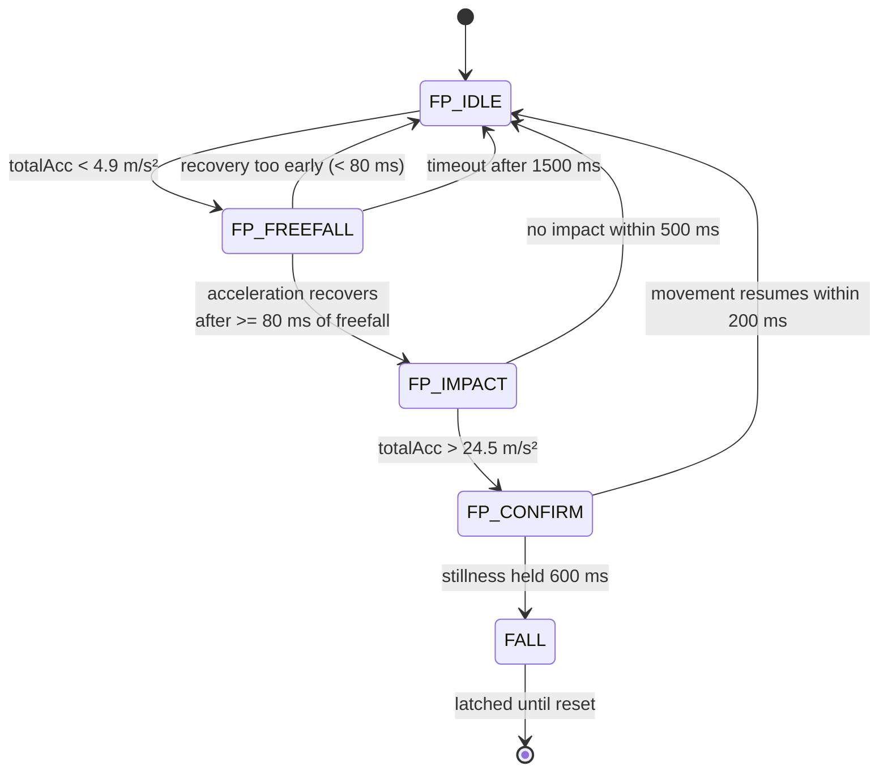

# Fall Detection

Fall detection is implemented in `detectFall()` as an explicit four-state machine. A single acceleration threshold is easy to trip during ordinary activity such as setting down tools, jumping from a low step or knocking the helmet against a surface, so the firmware instead requires three physically distinct events to occur in the correct order and within bounded time windows.

## The three-phase principle

A genuine fall has a characteristic signature. The body first enters near-freefall, so measured acceleration collapses towards zero. It then strikes a surface, producing a short high-magnitude spike. Afterwards an incapacitated worker remains still. Requiring all three in sequence rejects events that satisfy only one condition.

## State machine

## Thresholds

| Constant | Value | Meaning |
|----------|-------|---------|
| `FF_THR` | 4.9 m/s² | Freefall entry threshold, half of standard gravity |
| `FF_MIN_MS` | 80 ms | Minimum freefall duration before an impact is accepted |
| `IMP_THR` | 24.5 m/s² | Impact threshold, roughly 2.5 g |
| `IMP_MAX_MS` | 500 ms | Window in which the impact must follow the freefall |
| `STILL_DEV` | 2.94 m/s² | Tolerance around gravity that counts as stationary |
| `STILL_MS` | 600 ms | Stillness duration required to confirm |

The 1500 ms guard in `FP_FREEFALL` prevents the machine from becoming stuck if acceleration stays low, for example if the helmet is resting in an orientation that produces a sustained low reading.

## Phase behaviour

**FP_IDLE** watches for acceleration magnitude dropping below `FF_THR` and records the entry timestamp.

**FP_FREEFALL** waits for acceleration to recover above the threshold. If the freefall lasted at least `FF_MIN_MS` the machine advances and starts the impact timer; if it recovered sooner the event is discarded as noise and the machine returns to idle.

**FP_IMPACT** requires a spike above `IMP_THR` within `IMP_MAX_MS`. Missing that window returns the machine to idle.

**FP_CONFIRM** measures how long acceleration stays within `STILL_DEV` of gravity. Holding for `STILL_MS` latches the fall. If movement resumes within the first 200 ms the machine returns to idle, treating the event as a stumble the worker recovered from.

## Actions on confirmation

Once latched, the firmware increments the session fall counter, starts buzzer pattern 0, appends a timestamped entry to the rolling alert log, writes the event to the offline NVS queue, updates hazard-zone clustering with the last known coordinates, and persists session state. The `fallDetected` flag stays latched until an operator clears it through the dashboard's Reset Alert control, so an alert cannot be missed simply because the worker was moved.

## Validation status

The threshold values above are the constants present in the firmware. **No quantified detection rate, false-positive rate or latency measurement exists in the project files, and none is claimed here.** The staged design is a recognised approach to suppressing false positives, but suppression by design is not the same as measured performance. Establishing real figures would require a scripted test protocol covering genuine falls, near-falls and common work activities such as bending, kneeling, climbing and sitting down heavily, with each trial logged against ground truth.

_TODO: record and publish validation results once a structured test protocol has been executed._
