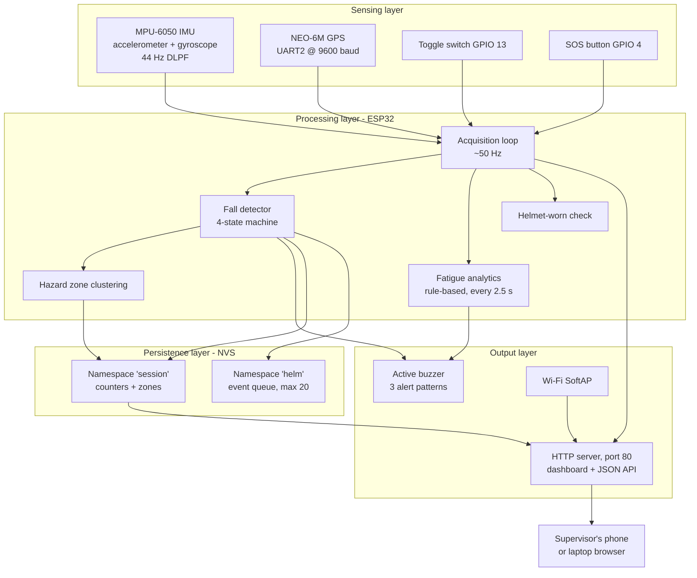

# System Architecture

Sentry AI is a self-contained edge device. All sensing, decision logic and user interface are executed on the ESP32; there is no cloud component, no external broker and no companion mobile application. This is a deliberate consequence of the target environment, where connectivity on an industrial site cannot be assumed.

## Component view

## Execution model

The firmware is a single-threaded cooperative loop. There is no RTOS task partitioning and no interrupt-driven sampling; every subsystem is polled in sequence.

| Stage | Cadence | Mechanism |
|-------|---------|-----------|
| Main loop iteration | ~50 Hz | `delay(20)` at the end of `loop()` |
| IMU sample and derived metrics | Every iteration | `mpu.getEvent()` |
| Fall state machine | Every iteration | `detectFall()` |
| GPS parsing | Every iteration | `readGPS()` drains the UART buffer |
| Fatigue analytics | Every 2500 ms | Guard inside `runAI()` |
| Serial diagnostics | Every 1000 ms | Guard inside `loop()` |
| Dashboard refresh | Every 5 s | `<meta http-equiv='refresh' content='5'>` |
| HTTP request handling | Every iteration | `server.handleClient()` |

Because all work happens in one loop, blocking operations directly affect detection latency. The buzzer is therefore driven by a non-blocking pattern generator in `controlBuzzer()` that compares elapsed milliseconds rather than calling `delay()`, so alarms sound while sensing continues. The startup and shutdown beeps are the exception; they use `delay()` deliberately, since monitoring is not active at those moments.

## Master switch semantics

The toggle switch on GPIO 13 is the system's primary state control, edge-detected in `loop()`.

| Transition | Handler | Effect |
|------------|---------|--------|
| `HIGH -> LOW` (switch closed) | `systemStart()` | Clears alert flags, resets the fall state machine and analytics buffer, reloads persisted counters, plays the startup beep |
| `LOW -> HIGH` (switch opened) | `systemStop()` | Persists session data, silences the buzzer, plays the shutdown beep |

While `systemActive` is false the loop services HTTP requests and then returns early after `delay(100)`, so the dashboard stays reachable but no sensor processing occurs. `setup()` also checks the switch position at boot and starts monitoring immediately if it is already closed.

## Derived signals

Two scalar values drive nearly all downstream logic:

- **Acceleration magnitude** — the Euclidean norm of the three accelerometer axes, `sqrt(ax^2 + ay^2 + az^2)`, expressed in m/s². At rest this sits near 9.81.
- **Tilt angle** — `degrees(acos(az / totalAcc))`, the angle between the helmet's Z axis and the gravity vector, clamped to the valid domain of `acos` before conversion.

Helmet-worn detection combines both: the helmet is considered on a head when the acceleration magnitude is within 3.0 m/s² of gravity and tilt is below 60°. This is a coarse heuristic that distinguishes a stationary upright helmet from one lying on a surface or being carried; it is not a contact sensor and cannot prove the helmet is actually on a person.

## Design trade-offs

Running entirely on-device removes any dependency on site connectivity and keeps worker location data on hardware the employer physically controls, which is a meaningful privacy property. The cost is that a supervisor must be within Wi-Fi range of the helmet to see its dashboard, and that each helmet is an island: there is no fleet view, and no alert reaches anyone who is not connected to that specific device's Access Point. Section 17 of the root README treats this as the principal item of future work.
