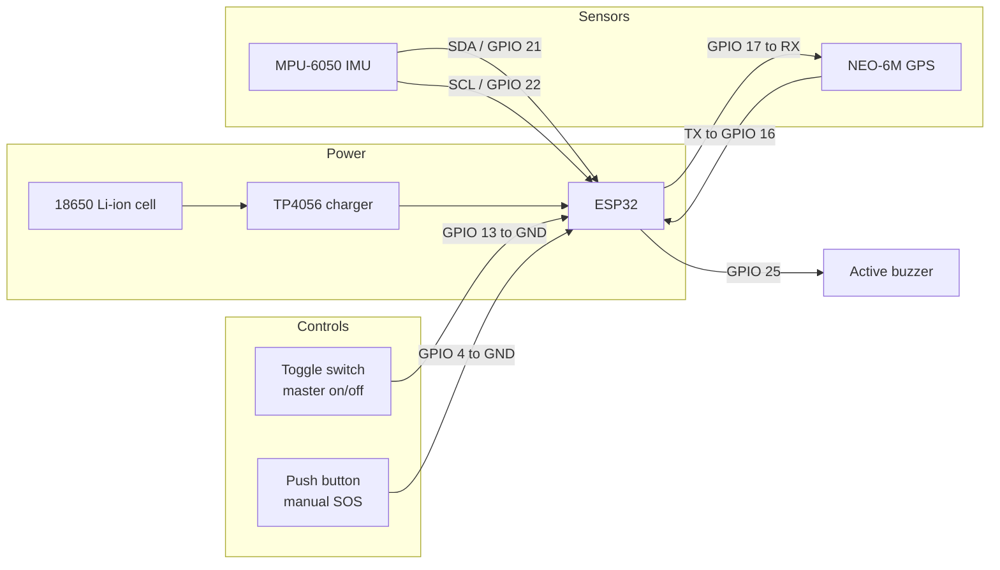

# Pinout and Wiring

All assignments below are read directly from `firmware/src/sentry_helmet.ino`.

## Pin map

| ESP32 pin | Direction | Connected to | Source in firmware |
|-----------|-----------|--------------|--------------------|
| GPIO 21 (SDA) | Bidirectional | MPU-6050 SDA | `Wire.begin()` — ESP32 I2C default |
| GPIO 22 (SCL) | Output | MPU-6050 SCL | `Wire.begin()` — ESP32 I2C default |
| GPIO 16 (RX2) | Input | NEO-6M **TX** | `gpsSerial.begin(9600, SERIAL_8N1, 16, 17)` |
| GPIO 17 (TX2) | Output | NEO-6M **RX** | `gpsSerial.begin(9600, SERIAL_8N1, 16, 17)` |
| GPIO 25 | Output | Active buzzer (+) | `const int BUZZER_PIN = 25;` |
| GPIO 4 | Input, pull-up | SOS push button to GND | `const int BUTTON_PIN = 4;` |
| GPIO 13 | Input, pull-up | Master toggle switch to GND | `const int SWITCH_PIN = 13;` |
| 3V3 / GND | Power | MPU-6050, NEO-6M, buzzer | — |

## Connection diagram

## Wiring rules

Because both inputs rely on the ESP32's internal pull-up resistors, wire each switch and button as a simple closure to ground. An actuated control therefore reads `LOW`, which is how the firmware detects the transitions `HIGH -> LOW` for switch-on and SOS press.

Cross the GPS serial lines: the module's TX goes to the ESP32's RX (GPIO 16) and the module's RX goes to the ESP32's TX (GPIO 17). Wiring these straight through is the most common cause of a GPS module that never produces a fix.

## Photographs

_TODO: add wiring photographs and an annotated assembly image of the physical prototype. No hardware images were available in the source material._
